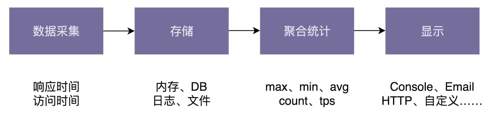

#### 需求  
开发出一个具备好的易用性、高性能、高扩展性、高容错性以及高通用性的统计接口调用的各种统计信息的框架。该框架可以统计接口的响应时间的最大值、最小值、平均值、百分位值、接口调用次数、频率等，并支持将统计结果以各种显示格式（JSON格式、网页格式、自定义格式等）输出到各种终端（Console命令行、HTTP网页、Email、日志文件、自定义输出终端等）。  
#### 分析  
· 接口统计信息：接口响应时间的统计信息，以及接口调用次数的统计信息。  
· 统计信息的类型：max、min、avg、percentile、count、tps等。  
· 统计信息显示格式：JSON、HTML、自定义格式显示。  
· 统计信息显示终端：Console、Email、HTTP网页、日志、自定义显示终端。  

#### 系统设计流程图  

